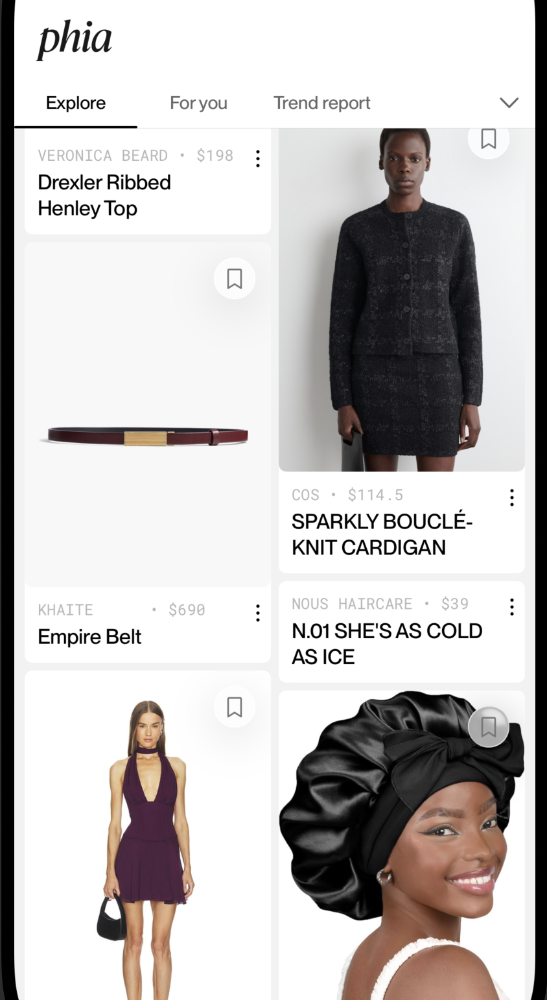

# Phia Onsite Demo

## Testing the App
- When opening the app, click on the Phia logo to see a secret menu pop up. If you want to stress test the scroll w/ much more data, you can choose a multiplier value (1x, 3x, 5x, 10x) to indicate how many times you want each fetched page of cards to be duplicated.
- If you want to revisit how the app reacts when pulling images freshly, there's a `Clear Cache` action in the menu as well.

## Bonuses

- All card variants were implemented.
- Optimized scroll masonry grid by: lazy loading height-balanced batches of cards, smart image caching and image scaling (memory <= 200 MB always)
- Handled card presentation for optional properties of different entities (e.g. UI for Product card looks good even with no primary image)

## Assumptions

#### Editorial (Primary) Card
- For the horizontal products scroll. I assumed that each product frame should have the same width and height, while the image fills the frame.
- Based on the Figma, I gathered that the editorial's primary photo should have variable height.
- I applied the verified checkmark to every user handle. Figma screens showed checkmark for select brands, but there was no way of making that distinction via the API.

#### Outfit (Primary) Card
- Since it uses a horizontal paging scroll view in the Figma, I combined the outfit `imgUrl` and items of products array's `imgUrl` and placed it in the scroll view's content. So the outfit image comes first, then its products right after.

#### Outfit (Secondary) Card
- The single outfit photo is just the primary outfit image with each payload.

#### Editorial (Secondary) Card
- The 3 product images on the right side are equal height (dynamic based on primary editorial image) but fixed width.

## Architecture

The app is split into 5 SPM packages - each providing a unique capability.

- `DesignSystem`: contains all design related elements (Colors, Fonts, Images, `.xcassets`), generic components (glass background fallback for iOS 18, reusable paging indicator), and view-based extensions.
- `PhiaAPI`: endpoint and response object representations, preview objects for feed items + other basic networking setup.
- `ImageService`: a cache-backed image downloading service, allowing fast retrieval of images and their aspect ratios. Also handles image downsampling implicitly.
- `Feed`: views and application-level models for the Explore and For You masonry-style feed.
- `Detail`: detail views for the feed entities.

### Masonry Grid - Architecture

At first, I decided to go with the approach of an HStack of two LazyVStacks instead of the Layout protocol since I was worried that the Layout protocol computes sizes and other subview data without the subview necessarily being on screen (no lazy loading). 

But after much testing, I realized that the two LazyVStack approach still had a small issue: the two lazy containers are independent of each other, and can't synchronize their off-screen height estimation, leading to a "push and stutter effect" as you scroll up where one column's contents get pushed down. This happened quite frequently, and was very disturbing.

**Layout Protocol**

Then I decided to try the Layout protocol approach. If I was going to go with this, I knew that the images had to be deallocated whenever they moved off the scroll view's visible content area. Because the main bottleneck in terms of performance and memory was images. Keeping everything else in memory had trivial costs in comparison. With more time I could have used techniques to simulate the LazyVStack's lazy loading in this custom layout.

The UIImage was stored in our custom async image's `@State` property via the `loaded(UIImage)` state, meaning it would persist throughout the view's life. I wanted to avoid that for views off the visible area, `onDisappear` wouldn't work since it's only triggered when a view was removed from the hierarchy - which doesn't happen in the `Layout` protocol implementation. Then I found `onScrollVisibilityChange`, allowing me to remove the image from the cell's state whenever its visibility changed. This would ensure that only images that need to be displayed are ever rendered and kept in memory.

**Layout Protocol + Batched Lazy Loading**

To combine the best of both worlds, each page of data that arrived was analyzed for the diff in height between the columns they'd display, then in the layout protocol's subview size computation we'd extend the height of each card in the shortest column such that that both columns are equal in size. Since we smartly binned the cards into the proper column initially, the column height difference was small, so when we extended the cards' heights, the effect on the UI was unnoticeable for the better.

This column equality operation would happen in batches. A page of masonry cards would be one batch with its own MasonryLayout instance. We'd have multiple batches (one per page) in out scroll view, but our batches are contained in a LazyVStack, so when one batch is rendered, others aren't, making the performance super strong and the number of rendering cycles minimal (less work for main thread).

To perform the size checking properly, we have to prefetch all the dynamic-height-influencing images of the cards (in essence, just the primary cards) and save their aspect ratios. With layout value keys, we'd pass that info the masonry layout so that it can factor the real size of the card in its computation and decisino process. Even when done in parallel, the speed of image fetching was faster than I expected, the page loading didn't feel any different in terms of latency.

### Repository Pattern

I created a `FeedRepository` protocol type that would enable us to deliver Phia feed items via any mechanism (e.g. REST API, SQLite on Disk, mock repository with test data). Allowing our app's functionality to abstracted from the data source.

With more time I would've created separate data models for the application layer (as opposed to using the `PhiaAPI` provided response payload directly). Given the scope of this project I preferred to stay simple, so using the response object -provided models made more sense.

I separated the API endpoint building process into a `PhiaAPI` object, which `RemoteFeedRepository` would use to make explicit requests.

**UIImage Inefficiency**

This was a trivial problem in comparison to the aforementioned, but UImage's internals cache the images that were previously loaded in memory + some images were being decoded into full resolution unnecessarily. So instead of creating a UIImage directly from a Data buffer, I went down to CGImage to specify the caching rule (to avoid caching), and downsampling rule so that we'd only decode the image into the necessary pixel size for the image frame.

The downsampling amount is determined by the `displayWidth` (an upper bound of the width we expect this image to occupy) passed into the async images, which allows us to calculate the ideal pixel size to render the image in without losing quality (all while preserving memory!). This way we have smaller memory buffers for brand logos (like Phia), and products nested within views like Outfit or Editorial while the larger pixel sizes are set for images in the detail view, etc.

**Custom `PhiaAsyncImage`**

I created `PhiaAsyncImage` since the native `AsyncImage` capabilities were too limited for my performance needs. `PhiaAsyncImage` works with `ImageService` to cache image aspect ratios and images themselves on disk via the system's `cacheDirectory`. From research, the OS cleans apps' `cacheDirectory` as needed, so its contents won't overwhelm the user's disk space.

`PhiaAsyncImage` also handles the presentation for loading, idle, and empty states. Whenever the async image goes out of the scrolling visible area, the state is reset to `idle` to make sure that the stored image doesn't take up memory while it's not visible.

Improvements? 

The Explore API also doesn't provide metadata about the image's size. I'm not sure why the backend doesn't do this - I'd assume due to some computational cost - but if the backend pre-processes every Outfit / Editorial / Product image that's uploaded to it by Phia editors or other brand editors (to extract the aspect ratio) then latency would improve by a lot since we dont need to spend any time preprocessing images for their aspect ratios.

## Memory Examples

**High Memory**

The memory footprint below was from the grid implementation before CGImage downsampling and memory cache disabling was implemented. Notice how 93 image objects are kept in memory? This was because of the internal caching done by UIImage when initialized with `Data` as opposed to `CGImage`. You can even see that an image not displayed in the simulator's masonry grid is still shown in the memory graph (Right-Click > Quick Look). This isn't even the peak, at one point the memory footprint was 700MB.

**Low Memory**

The examples below are from when CGImage downsampling and memory cache disabling was implemented. This is also from when the final explore feed page was fetched (after all data is loaded).

