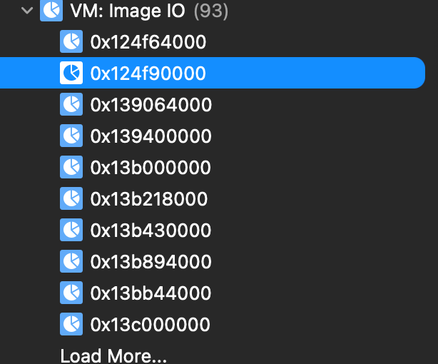
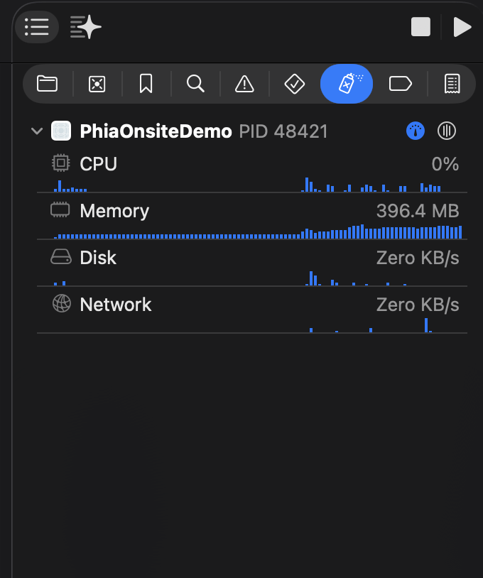
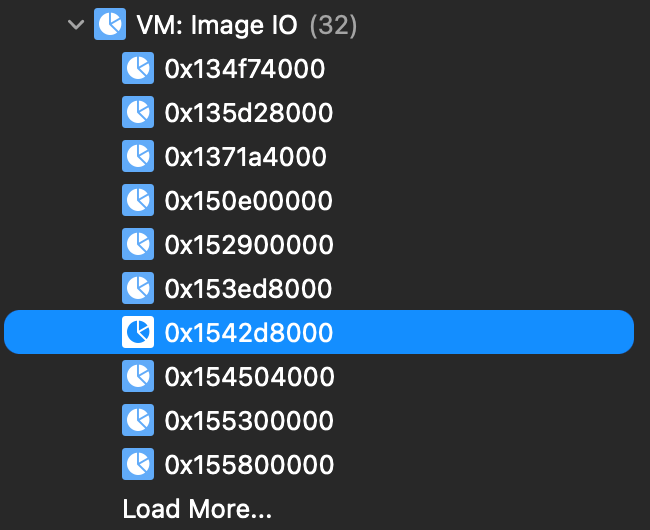
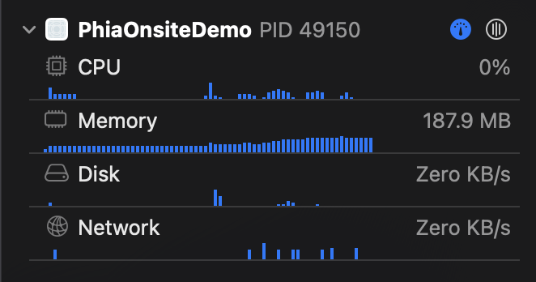

# Phia Onsite Demo

## Bonuses

- All card variants were implemented.
- Optimized scroll masonry grid with smart image caching and image scaling (memory <= 200 MB always)
- Handled card presentation for optional properties of different entities (e.g. UI for Product card looks good even with no primary image)

## Assumptions

#### Editorial (Primary) Card
- For the horizontal products scroll. I assumed that each product frame should have the same width and height, while the image fills the frame.
- Based on the Figma, I gathered that the editorial's primary photo should have variable height.
- I applied the verified checkmark to every user handle. Figma screens showed checkmark for select brands, but there was no way of making that distinction via the API.

#### Outfit (Primary) Card
- Since it uses a horizontal paging scroll view in the Figma, I combined the outfit `imgUrl` and items of products array's `imgUrl` and placed it in the scroll view's content. So the outfit image comes first, then its products right after.

#### Outfit (Secondary) Card
- The single outfit photo is just the primary outfit image with each payload.

#### Editorial (Secondary) Card
- The 3 product images on the right side are equal height (dynamic based on primary editorial image) but fixed width.

#### Masonry Grid
- On first-ever load, I use the estimated height of each feed item type as a heuristic to place the feed item into the appropriate column. For subsequent loads, I use a cached aspect ratio value derived from the disk.

## Architecture

### Masonry Grid - Architecture

At first, I decided to go with the approach of an HStack of two LazyVStacks instead of the Layout protocol since I was worried that the Layout protocol computes sizes and other subview data without the subview necessarily being on screen (no lazy loading). 

But after much testing, I realized that the two LazyVStack approach still had a small issue: the two lazy containers are independent of each other, and can't synchronize their off-screen height estimation, leading to a "push and stutter effect" as you scroll up where one column's contents get pushed down. This happened quite frequently, and was very disturbing.

Then I decided to try the Layout protocol approach. If I was going to go with this, I knew that the images had to be deallocated whenever they moved off the scroll view's visible content area. Because the main bottleneck in terms of performance and memory was images. Keeping everything else in memory had trivial costs in comparison. With more time I could have used techniques to simulate the LazyVStack's 'lazy loading in this custom layout.

The UIImage was stored in our custom async image's @State property which meant it would persist throughout the view's life. We wanted to avoid that for views off the visible area, `onDisappear` wouldn't work since it's only triggered when a view was removed from the hierarchy which wasn't the case in the `Layout` protocol implementation. Then I found `onScrollVisibilityChange`, allowing me to remove the image from the cell's state whenever its scroll visibility changed. This would ensure that only images that need to be displayed are ever rendered and kept in memory.

Another problem arose, UImage's internals cache the images that were previously loaded in memory + some images were being decoded into full resolution unnecessarily. So instead of creating a UIImage directly from a Data buffer, I went down to CGImage to specify the caching rule (to avoid caching), and downsampling rule so that we'd only decode the image into the necessary pixel size for the image frame.

The downsampling amount is determined by the `displayWidth` passed into the async images, which allows us to calculate the ideal pixel size to render the image in without losing quality (all while preserving memory!). This way we have smaller memory buffers for brand logos (like Phia), and products nested within views like Outfit or Editorial while the larger pixel sizes are set for images in the detail view, etc.

### Repository Pattern

I created a `FeedRepository` protocol type that would enable us to deliver Phia feed items via any mechanism (e.g. REST API, SQLite on Disk, mock repository with test data). Allowing our app's functionality to abstracted from the data source.

With more time I would've created separate data models for the application layer (as opposed to using the `PhiaAPI` provided response payload directly). For simplicity, using the response object -provided models made more sense.

I separated the API endpoint building process into a PhiaAPI object, which `RemoteFeedRepository` would use to make explicity requests.

